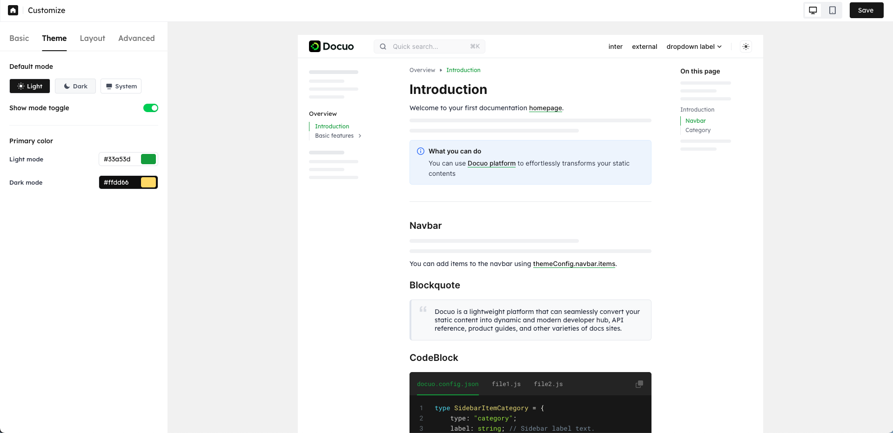

# Customize through platform

Customizing lets you control your website branding, presentation, and more extra features of your website public content.

You can set your website basic settings, theme, layout, and advanced settings in your project **Customize** tab with ease. You can also directly preview your settings in real time, which will make your customization more intuitive.

<Note title="Note">
Once you save your customization settings, the settings will be saved to the json file and updated to your website.
</Note>

## Basic customization

The basic customization includes the following settings:
- **Favicon**  The small icon assiciated with the website, which typically appears on the browser tabs, bookmarks, and the adress bar.
- **Remove watermark**  You can choose to keep or remove Docuo watermark that appears at the bottom of the sidebar of the website page.
- **Custom domain**  Set up your custom domain and custom proxy. See [Custom domain](./custom-domain.mdx) document for more information. 

<Frame width="auto" height="auto" >
  
</Frame>

## Theme customization

The theme customization controls the visual style of your publsihed website, including:
- **Default mode** Define whether your visitors to the published website will initially view it in light mode or dark mode. 
- **Show mode toggle** You can choose to show or hide the mode switch located at the header of the website. If you would like your visitors to your published website to be able to change between light or dark mode, please enable it.  
- **Primary color** Define the color scheme of published content on the website.You can choose any colors you'd like. You need to set up light mode primary color and dark mode primary color separately. 

<Frame width="auto" height="auto" >
  
</Frame>

## Layout customization

The layout customization enables you yo manage navigation options for your website content.

### Header

Header is a necessary module for the website.

| Setting         | Description                                                                                                     | 
| --------------- | --------------------------------------------------------------------------------------------------------------- |
| Logo            | Uplode a custom logo that reflects your own branding. You need to set the light and dark mode logos seperately. |
| Logo URL        | Link to navigate to when the logo is clicked.                                                                   |
| Title           | The word title next to your Logo. If your logo contains your brand title, this setting is unnecessary.          |
| Link            | Support one level and two level dropdown navigation.You can set up both external and internal links.             |

<Frame width="auto" height="auto" >
  
</Frame>

### Footer

Footer is an optional module for the website. You can decide whether to display the footer module at the bottom of the website page. 

| Setting         | Description                                                                                                              |
| --------------- | ------------------------------------------------------------------------------------------------------------------------ |
| Logo            | Uplode a custom logo that reflects your own branding. You need to set the light and dark mode logos seperately.          |
| Logo URL        | Link to navigate to when the logo is clicked.                                                                            |
| Caption         | The website brand description or whatever you want to say, which will be displayed below the footer logo.                |
| Copyright       | The copyright statement for your website, which will be displayed at the bottom of the website page.                     |
| Link            | The link groups to be present on the footer. You can set up both external and internal links.                            |
| Social link     | The social link groups to be present. You can directly use the social media icons we prepared, or upload your own icons. |

<Frame width="auto" height="auto" >
  
</Frame>

## Advanced customization

Advanced customization includes search box setting and sitemap information.

You can define whether to show search box on your website. See [**Search**](../engaging-users/search.mdx) for more information. 

<Frame width="auto" height="auto" >
  
</Frame>

