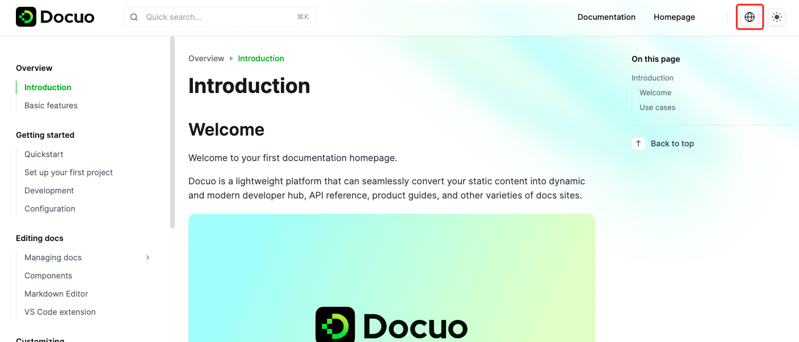

# Internationalization

Internationalization (i18n) settings in documentation let you prepare and configure your documentation to support multiple languages and locales.

You can configure **i18n** in `docuo.config.json` file. Here's an example:

```json docuo.config
{
  "i18n": {
        "defaultLocale": "en",
        "localeConfigs": {
            "en": "English",
            "zh_CN": "简体中文"
        }
    }
}
```


Once you have configured **i18n**, the website navbar will display a language switcher, regardless of whether there are actual documents for the corresponding languages.

<Frame width="auto" height="auto" >
  
</Frame>


