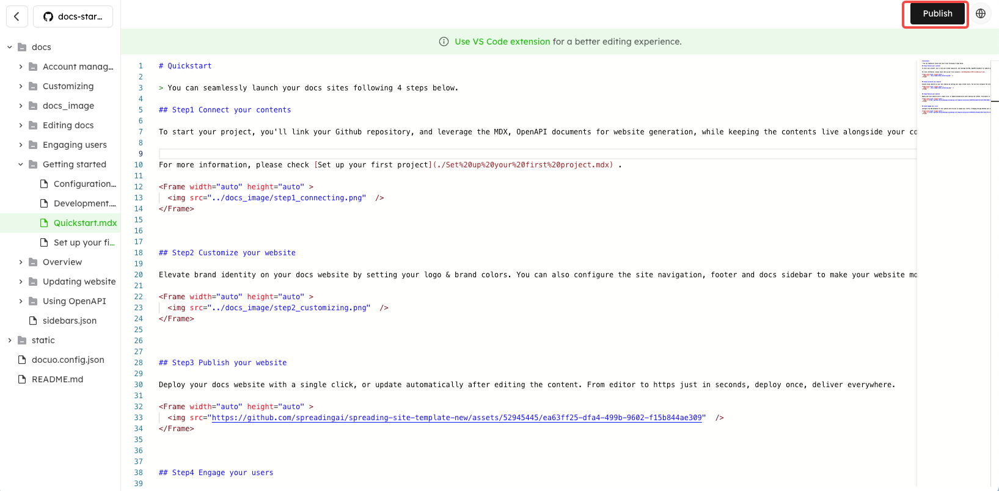

# Markdown editor

You can directly edit your documents using the markdown editor on the platform.

<Note title="Note">
The Markdown Editor uses a short-hand syntax style text to create documents and then converts the text to HTML. It is handy when more text files are involved.
</Note>

Log in to Docuo platform, and click "Editor" to enter the markdown editor page. You will see your docs repository directory on the left side of the page.

You can edit your existing md/mdx or json files on the platform. Then click "**Publish**" button in the upper right corner of the page to update your edited content to the website.

<Frame width="auto" height="auto" >
  
</Frame>

<Tip title="Tip">
Recommend you to use [**VS Code extension**](https://marketplace.visualstudio.com/items?itemName=spreading-docuo.docuo) for a better editing experience.
</Tip>
