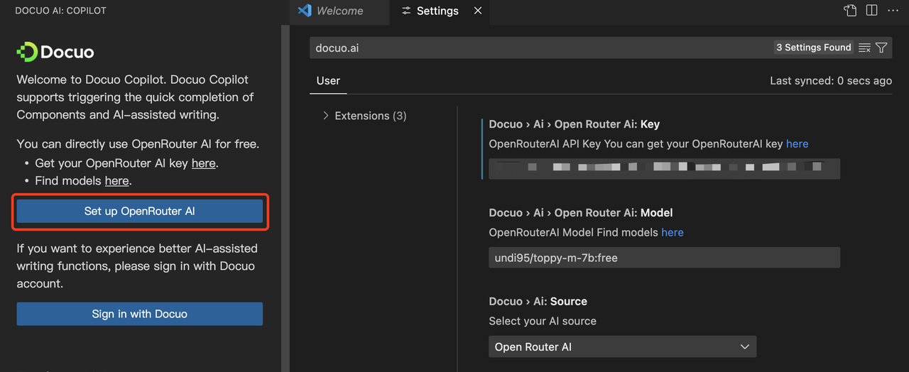
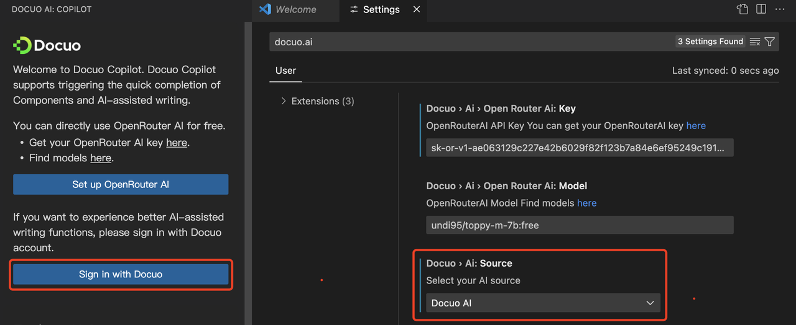
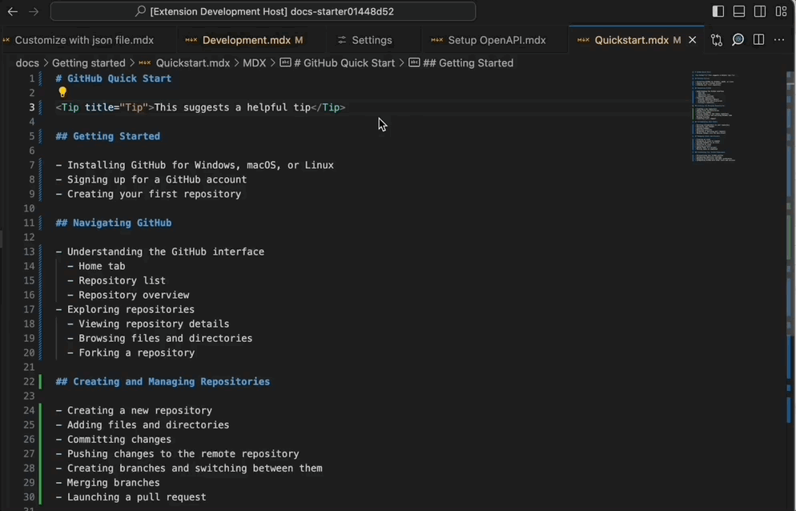

# VS Code extension

Docuo also launches the AI-powered VS Code extension to help you save writing time and improve your codebase.
Using Docuo extension can exert the most powerful function of Docuo
[Install Docuo extension on VS Code](https://marketplace.visualstudio.com/items?itemName=spreading-docuo.docuo)

## Trigger Suggest

After you successfully set up Docuo extension,  you can trigger the quick completion of Components provided by Docuo when you open MD and MDX documents.

| Suggest                               | Description                                        |
| :------------------------------------ | :------------------------------------------------- |
| Docuo: Image                          | Insert image with component>.                      |
| Docuo: Video                          | Insert Youtube,Vimeo and Loom online video         |
| Docuo: Tip                            | Insert Tip callout                                 |
| Docuo: Note                           | Insert Note callout                                |
| Docuo: Warning                        | Insert Warning callout                             |
| Docuo: Error                          | Insert Error callout                               |
| Docuo: Code block                     | Insert a simple code block                         |
| Docuo: Code block with file name      | Insert a code block with file name                 |
| Docuo: Code block with highlighting   | Insert a code block with highlighting lines        |
| Docuo: Code group                     | Aggregate multiple code blocks into one code group |

## Write with AI

Docuo offers AI-powered writing assistance functions, which can boost your writing productivity and improve the quality of your content.
We now support the following AI functions:

**Generate content**
- Generate outline: Generate article's outline based on the type、target users and theme description.
- Generate doc from code: Generate article content through code.

**Improve content**
- Improve Writing: Optimize document content expression
- Fix spelling and grammar: Make your content output more accurate
- Make Shorter: Simplify document content
- Make Longer: Enrich document content 

**Improve code**
- Clean code: Improve the quality of code code content, making code more accurate and easier to understand.
- Convert code: Convert your code from one language into another target language.
- Explain code: Explain the meaning and purpose of code in plain language.

### Use OpenrRouter AI

You can directly use OpenRouter AI without signing in with Docuo account in three steps. 
1. Go to Docuo extension settings page.
2. Set up [OpenRouter AI key](https://openrouter.ai/keys).
3. Choose your preferred [AI model](https://openrouter.ai/models). OpenRouter AI offers couples of free models for you.
Then you can start using the AI functions! Please make sure the selected AI source is **OpenRouter AI**.
Learn more about [OpenRouter AI](https://openrouter.ai/).

<Frame width="auto" height="auto">
  
</Frame>

### Use Docuo AI

If you want to experience better AI models, please sign in with Docuo account. Using Docuo AI will consume AI credits of your first workspace. You can check your remaining AI credits on the [Plans page](https://app.spreading.ai/plan) of Docuo platform. If you want more AI credits, please upgrade your plan. 
Please make sure the selected AI source is **Docuo AI**.

<Frame width="auto" height="auto">
  
</Frame>

## Frontmatter

You can use frontmatter to customize some of the document information. Just right click and select "**Docuo**" → "**Insert frontmatter**", and choose the information you need.

<Frame width="auto" height="auto">
  
</Frame>

